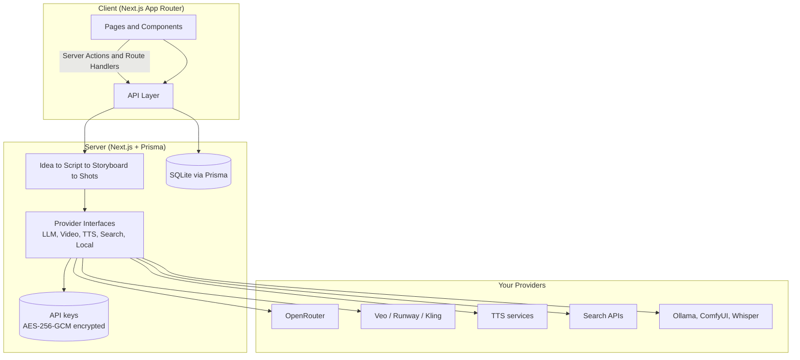

# AI Video Studio

An open-source, bring-your-own-key (BYOK) AI video production studio.

AI Video Studio takes you from an idea to a finished short video: scriptwriting, storyboarding, shot planning, asset generation, voiceover, and final assembly. It ships with a provider abstraction layer, so you plug in **your own API keys** for whichever AI services you use — the app itself is free and open source, and any provider fees are paid by you, directly to the providers.

---

## Features

- **Project-based workflow** — every video is a project with trackable stages (idea → script → storyboard → shots → assets → assembly → export).
- **BYOK provider settings** — add your own API keys per provider from the Settings UI. Keys are encrypted server-side (AES-256-GCM) and never leave the backend.
- **Demo mode** — explore the full UI without any API keys using mock data.
- **Provider abstraction** — five provider interfaces (`LLMProvider`, `VideoProvider`, `TTSProvider`, `SearchProvider`, `LocalProvider`) make it possible to swap services without touching the pipeline.
- **OpenRouter in Phase 1** — any OpenRouter-accessible chat model can drive the creative pipeline.
- **SQLite + Prisma** — zero-config local database; no server to set up.

## Demo

Run the app and open it in your browser — Demo mode is on by default and needs no keys.

- Demo mode renders the full studio shell with **mock data**: sample projects, a sample script, and sample storyboards, so you can click through every screen.
- No network calls are made in demo mode and no keys are required.
- To use real AI providers, open **Settings → Providers**, add your keys, and disable demo mode (see [BYOK setup](#byok-setup)).

## Architecture



Provider calls always flow **server-side**. Keys are decrypted in memory only for the outbound provider call — they are never sent to the browser, never logged, and never stored in plain text.

## Supported providers

| Provider | Type | Status |
|---|---|---|
| Demo mode | Built-in mock | ✅ Available |
| OpenRouter | LLM (text generation) | ✅ Available |
| Custom LLM (OpenAI-compatible) | LLM — OpenAI, Ollama, LM Studio, vLLM, any OpenAI-compatible server | ✅ Available (preferred when configured) |
| OpenAI TTS | Text-to-speech (`tts-1`, voices alloy/echo/fable/onyx/nova/shimmer) | ✅ Available |
| Tavily | Web search for research | ✅ Available |
| Video (Runway / Kling / Veo) | Video generation | ⚠️ Honest stub — not implemented yet (see below) |
| Ollama | Local LLM | ✅ Via Custom LLM (see [Local AI](#local-ai-ollama)) |
| ComfyUI / Whisper | Local image/video/transcription | 🗺️ Roadmap |

**Video generation is intentionally a stub.** Kling's official API needs
JWT auth (access key + secret signing) and Runway is async task-based
(create task → poll `GET /v1/tasks/{id}` → download an ephemeral URL),
billed per second. Wiring either safely needs a background job queue, not a
single request handler — so the Video provider reports "not configured" and
throws a clear error if called. Script, storyboard, and prompt stages work
without it, and voiceover scripts are always exportable as text.

See [ROADMAP.md](ROADMAP.md) for the full phase plan.

## Installation

Requirements: Node.js 24+, pnpm (via corepack), no database server needed (SQLite).

```bash
git clone https://github.com/your-org/ai-video-studio.git
cd ai-video-studio
cp .env.example .env
# Edit .env: set ENCRYPTION_KEY to a random 32-byte hex string, e.g.:
# openssl rand -hex 32
pnpm install
pnpm dev
```

Open [http://localhost:3000](http://localhost:3000).

## Environment variables

| Variable | Required | Purpose |
|---|---|---|
| `DATABASE_URL` | Yes | SQLite file location. Default `file:./data/app.db`; in Docker it must stay inside the `/app/data` volume |
| `ENCRYPTION_KEY` | Yes | 32-byte hex key used to encrypt stored provider API keys (AES-256-GCM). Generate with `openssl rand -hex 32`. The container refuses to boot without it |
| `OPENROUTER_API_KEY` | Optional | Seed key used to pre-configure OpenRouter (you can also add it via the Settings UI) |
| `OPENROUTER_MODEL` | Optional | Default model ID for OpenRouter calls (default: `openrouter/free`) |
| `VIDEO_PROVIDER_API_KEY` | Optional | Reserved — video generation is an honest stub for now |
| `TTS_PROVIDER_API_KEY` | Optional | Key for the TTS provider (OpenAI TTS). `OPENAI_API_KEY` is accepted as an alias |
| `TTS_BASE_URL` / `TTS_MODEL` / `TTS_VOICE` | Optional | TTS endpoint overrides (defaults: `https://api.openai.com/v1`, `tts-1`, `alloy`) |
| `SEARCH_PROVIDER_API_KEY` | Optional | Key for the search provider (Tavily). `TAVILY_API_KEY` is accepted as an alias |
| `CUSTOM_LLM_API_KEY` | Optional | Key for the Custom LLM provider; when set (env or Settings UI) and active, it becomes the primary AI provider |
| `CUSTOM_LLM_BASE_URL` | Optional | Base URL for the Custom LLM provider (default: `https://api.openai.com/v1`; use `http://localhost:11434/v1` for Ollama) |
| `CUSTOM_LLM_MODEL` | Optional | Default model for the Custom LLM provider (default: `llama3.1`) |
| `AUDIO_OUTPUT_DIR` | Optional | Directory for generated TTS audio (default: `./data/audio`) |

See [.env.example](.env.example) for a documented template.

## BYOK setup

Bring your own key — it takes about a minute:

1. **Get an OpenRouter key** — sign up at [openrouter.ai](https://openrouter.ai), open your dashboard, and create an API key. You pay OpenRouter directly for the models you use; AI Video Studio takes no cut.
2. **Open Settings** — in the app, go to **Settings → Providers**.
3. **Add the provider** — select **OpenRouter**, paste your key, and choose a default model.
4. **Test** — click **Test connection**. A successful test sends one tiny request and reports the result. Fix any errors (wrong key, no credits) before proceeding.
5. **Start creating** — create your first project; generation calls now use your key, billed to your OpenRouter account.

Keys are encrypted with AES-256-GCM before storage, stay on your server, and are never exposed to the browser or logs. See [SECURITY.md](SECURITY.md).

## Running locally

```bash
pnpm install
pnpm dev
```

Other useful commands:

```bash
pnpm lint              # ESLint
pnpm exec tsc --noEmit # Type check
pnpm test              # Vitest
pnpm build             # Production build
```

## Production deployment (Docker)

The app ships as a self-contained Docker image: multi-stage build
(`pnpm` deps → build → runner), Next.js `output: 'standalone'`, Prisma
migrations applied automatically at container start, SQLite + generated
assets persisted in a `./data` volume, and `ffmpeg` installed in the
runner image.

**Required env vars for production:**

| Variable | How to set |
|---|---|
| `ENCRYPTION_KEY` | `openssl rand -hex 32` — the container **refuses to boot** without it. Changing it later invalidates stored provider keys |
| `DATABASE_URL` | `file:./data/app.db` (default; keep it inside the `/app/data` volume) |
| Provider keys | `OPENROUTER_API_KEY`, `CUSTOM_LLM_*`, `TTS_PROVIDER_API_KEY`, `SEARCH_PROVIDER_API_KEY` — or add them later in Settings → Providers |

**With Docker Compose (recommended):**

```bash
cp .env.example .env
# edit .env: set ENCRYPTION_KEY (openssl rand -hex 32) + any provider keys
docker compose up --build -d
# open http://localhost:3000
docker compose logs -f app   # watch the boot / migration log
```

**With plain Docker:**

```bash
docker build -t ai-video-studio .
docker run -d --name ai-video-studio \
  --env-file .env \
  -p 3000:3000 \
  -v ./data:/app/data \
  --restart unless-stopped \
  ai-video-studio
```

### Deploy to a VPS (any host with Docker)

1. Copy the project to the server (`git clone` or `rsync`), `cd` into it.
2. Create `.env` from `.env.example`; set `ENCRYPTION_KEY` via
   `openssl rand -hex 32` and add provider keys.
3. `docker compose up --build -d`.
4. Put it behind HTTPS (Caddy/Nginx reverse proxy, e.g.
   `reverse_proxy localhost:3000` in a Caddyfile).

### Deploy to Render

1. Push the repo to GitHub.
2. Render dashboard → **New → Web Service** → select the repo.
   Render auto-detects the `Dockerfile`.
3. Add a **persistent disk**: mount path `/app/data`, size 1 GB+
   (without it, the SQLite DB resets on every deploy).
4. Environment variables: `ENCRYPTION_KEY` (generate), `DATABASE_URL`
   = `file:./data/app.db`, plus provider keys.
5. Deploy. The entrypoint runs `prisma migrate deploy` on first boot.

### Deploy to Railway

1. Push the repo to GitHub → Railway **New Project → Deploy from repo**.
2. Railway detects the `Dockerfile`. Add a **volume** mounted at
   `/app/data`.
3. Variables: `ENCRYPTION_KEY`, `DATABASE_URL=file:./data/app.db`,
   provider keys. Railway sets `PORT` automatically — the image
   respects `PORT` (defaults to 3000).

### Deploy to Fly.io

```bash
fly launch            # accept the Dockerfile-based app
fly volumes create ai_video_data --region <your-region> --size 1
```

Then in `fly.toml`:

```toml
[mounts]
  source = "ai_video_data"
  destination = "/app/data"

[env]
  DATABASE_URL = "file:./data/app.db"
```

```bash
fly secrets set ENCRYPTION_KEY=$(openssl rand -hex 32)
fly deploy
```

### Production notes

- **Migrations, not pushes:** the image entrypoint runs
  `prisma migrate deploy` on every start. Never run `prisma db push`
  against production.
- **Backups:** the whole app state is `./data/app.db` — back up the
  volume regularly (`sqlite3 data/app.db .dump`, or snapshot the disk).
- **ffmpeg** is installed in the runner image (`/usr/bin/ffmpeg`) for
  video assembly.

## Creating your first project

1. Open the dashboard and click **New project**.
2. Give it a title and describe your video idea in a sentence or two.
3. Walk the project through its stages: **Idea → Script → Storyboard → Shots** (Phase 1 ships the project system and the LLM pipeline scaffolding; later phases add asset generation, assembly, and export — see [ROADMAP.md](ROADMAP.md)).
4. At each generation step you can **approve, edit, or regenerate** the output before moving on. You stay in control of the creative direction; the AI drafts, you decide.

## Adding a provider

New providers are added by implementing one of the five provider interfaces. The interface definitions live at `src/lib/providers/types.ts` — that file is the contract:

- `LLMProvider` — text generation (chat completions, structured JSON output)
- `VideoProvider` — text/image-to-video generation jobs
- `TTSProvider` — text-to-speech synthesis
- `SearchProvider` — web/image/video search for research and reference material
- `LocalProvider` — local models (Ollama, ComfyUI, Whisper)

To add a provider: implement the relevant interface, register it in the provider registry, and wire its settings form into **Settings → Providers**. Keys entered in the UI are encrypted automatically — provider code must never handle raw keys outside the server-side call path.

## Local AI (Ollama)

No cloud key needed — run a model on your own machine and point the
**Custom LLM** provider at it:

1. Install Ollama from [ollama.com](https://ollama.com) and pull a model:
   ```bash
   ollama pull llama3.1
   ```
2. In the app, go to **Settings → Providers → Custom LLM
   (OpenAI-compatible)** and set:
   - **Model** to `http://localhost:11434/v1 | llama3.1`
     (or set `CUSTOM_LLM_BASE_URL=http://localhost:11434/v1` in `.env`)
   - **API key** to anything non-empty (Ollama ignores it, but the field is
     required to mark the provider configured) — or set
     `CUSTOM_LLM_API_KEY=ollama` in `.env`.
3. Click **Test connection** — you should see "Connected to custom LLM".

When the Custom LLM provider has a key and is active, it becomes the
**primary AI provider** for the whole pipeline (script, storyboard,
prompts). Disable or clear its key to fall back to OpenRouter. Any other
OpenAI-compatible server (LM Studio, vLLM, llama.cpp server) works the
same way — just change the base URL.

> Note: in Docker, `localhost` means the container itself. To reach Ollama
> on the host, use `http://host.docker.internal:11434/v1` (Docker Desktop)
> or run Ollama on the same Docker network.

## Video processing

## Video processing

Final assembly (timeline stitching, captions, export to MP4, and the ZIP project package format) is built on **FFmpeg** and lands in Phase 3. See [ROADMAP.md](ROADMAP.md) for the design.

## Security

- Provider API keys are encrypted server-side with **AES-256-GCM** (`ENCRYPTION_KEY`); stored keys are never sent to the client and never logged.
- All provider calls run server-side; the browser never sees a key.
- No keys in code, tests, or fixtures. CI runs with `ENCRYPTION_KEY=dummy-for-ci`.
- If a key leaks, revoke it at the provider and replace it in Settings. Full policy: [SECURITY.md](SECURITY.md).

## Cost considerations

AI Video Studio is free software, but **AI usage is not free**: every generation call is billed by the provider to the key you supplied.

- You pay providers (e.g. OpenRouter) directly, under their own pricing and billing.
- The app warns you before expensive operations: batch generation, video renders, and long TTS jobs show an estimated cost confirmation before running.
- Demo mode costs nothing and makes no network calls — use it to learn the workflow before spending a cent.

## Contributing

Contributions are welcome — bug fixes, new providers, UI improvements, docs. Please read [CONTRIBUTING.md](CONTRIBUTING.md) first, follow the TypeScript-strict code style, and **never commit API keys or secrets**. By participating you agree to the [Code of Conduct](CODE_OF_CONDUCT.md).

## Roadmap

AI Video Studio is built in six phases:

1. **Phase 1 (this build)** — project system, UI shell, OpenRouter provider, BYOK settings, demo mode.
2. **Phase 2** — Idea → Script → Storyboard → Shot prompts LLM pipeline with approve/edit/regenerate gates.
3. **Phase 3** — asset management, FFmpeg assembly, timeline, MP4 + ZIP export.
4. **Phase 4** — video provider implementations (Veo, Runway, Kling).
5. **Phase 5** — TTS + search providers.
6. **Phase 6** — local AI (Ollama, ComfyUI, Whisper).

Details, schemas, and honest "not yet built" markers: [ROADMAP.md](ROADMAP.md).

## License

MIT — see [LICENSE](LICENSE). Copyright: AI Video Studio contributors.
